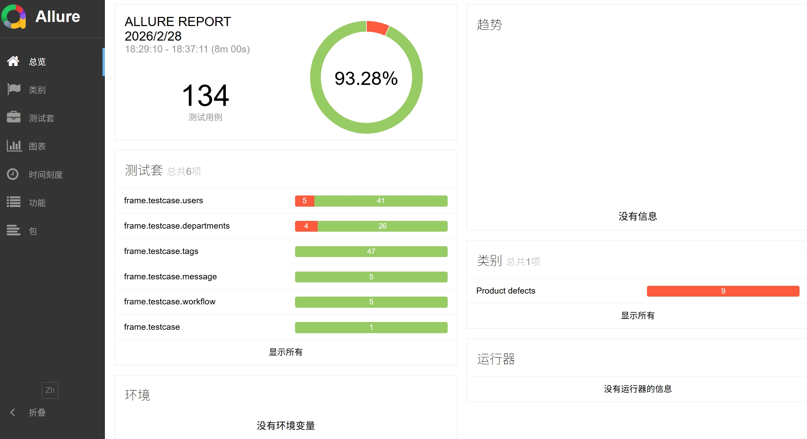
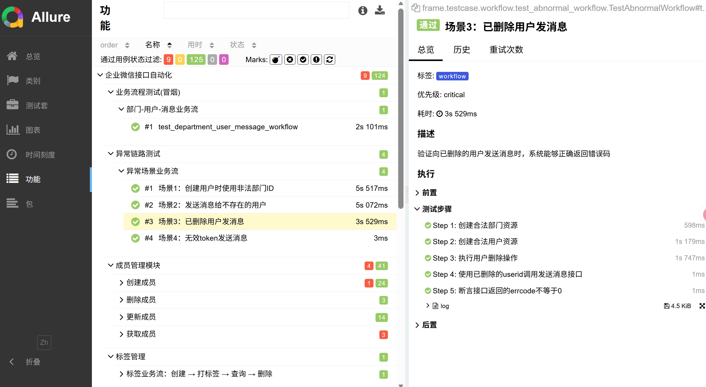
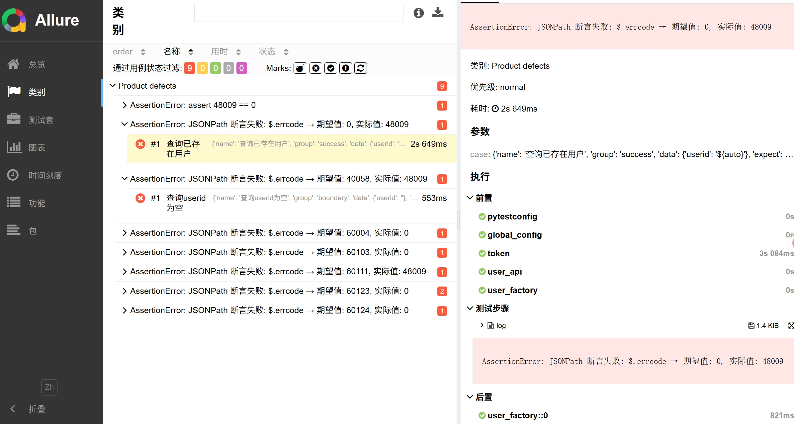
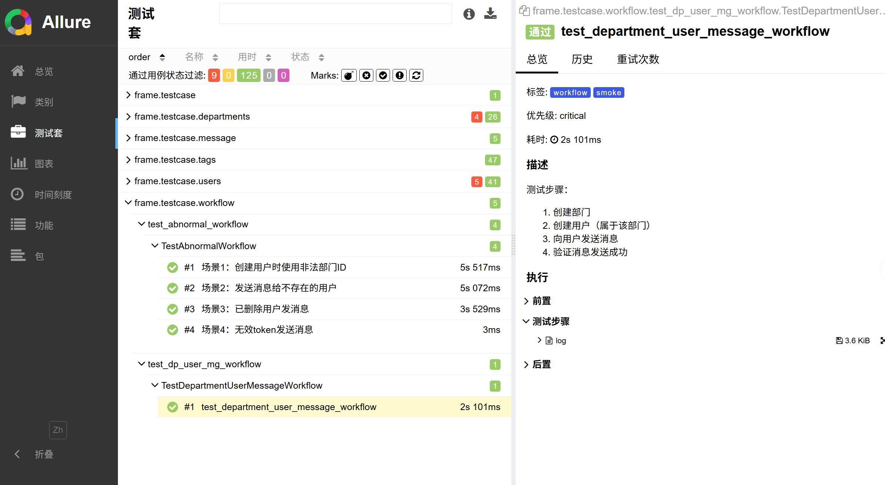

# 企业微信接口自动化测试框架

基于 **Python + Pytest + Requests + Allure** 构建的企业微信接口自动化测试框架，支持部门、用户、标签、消息等核心模块的自动化测试，包括数据驱动、fixture 工厂管理、业务流测试、异常链路测试、日志收集以及测试数据的自动准备和清理。

## 项目背景

- **项目简介**：企业微信接口自动化测试框架，覆盖通讯录管理和消息发送核心业务场景
- **技术栈**：pytest + requests + allure + PyYAML + jsonschema
- **Python 版本**：Python 3.13.6

##  测试概览

- 接口自动化用例：134条
- 业务流测试&异常链路：8条
- 当前用例通过率：93.28%
- 已接入 Allure 可视化报告

###  主要测试
-  各个模块单接口参数化测试（YAML数据驱动）
-  各模块多接口依赖业务流测试
-  各模块多接口依赖异常链路验证

### 报告截图







## 项目能力

- **pytest测试框架** ：支持 fixture(获取api实例和token)、参数化、标记；requests库(http客户端库)
- **分层设计** ：APIs 层（接口封装）、Common 层（通用工具）、Testcase 层（测试用例）三层架构，，提升复用性和可维护性 
- **YAML 数据驱动** ：支持多模块的创建、查询、更新、删除用例全部数据驱动
- **fixture 工厂管理** ：department_factory、user_factory 实现资源生命周期管理和自动清理
- **日志封装** ：统一的 logger 封装，支持请求/响应日志记录
- **Allure 报告** ：完整的 epic/feature/story/step 注解体系
- **Mock 支持** ：MessageApi 支持 MOCK_MESSAGE 开关，兼容真实请求和模拟测试
- **jsonpath/Schema 校验** ：设计统一断言机制，结合jsonpath / jsonschema对接口响应字段与结构校验
- **CI(持续集成)** ：基于 GitHub Actions 构建了端到端的自动化集成流水线
- **多环境切换** ：支持多环境切换，命令行一键切环境

## 项目目录结构

```
auto_interface/
├── frame/                              # 框架核心代码
│   ├── apis/                           # 接口层：封装企业微信各模块 API
│   │   ├── base_api.py                 # 基类，统一封装 GET/POST 请求
│   │   ├── contacts/                    # 通讯录接口
│   │   │   ├── departments.py           # 部门管理接口
│   │   │   ├── users.py                # 用户管理接口
│   │   │   └── tags.py                # 标签管理接口
│   │   └── message/                    # 消息接口
│   │       └── message.py              # 消息发送接口（支持 Mock）
│   │
│   ├── common/                          # 通用工具层
│   │   ├── logger.py                   # 日志封装
│   │   ├── assertions.py               # 自定义断言（JSONPath、Schema）
│   │   ├── tools.py                   # 工具函数（YAML 加载、占位符替换）
│   │   ├── config.py                   # 配置读取模块
│   │   ├── db.py                      # 数据库连接封装
│   │   └── schema.py                  # JSON Schema 校验
│   │
│   ├── config/                          # 配置文件
│   │   ├── dev.yaml                   # 开发环境配置
│   │   ├── prod.yaml                  # 生产环境配置
│   │   └── test_env.yaml              # 测试环境配置
│   │
│   ├── datas/                           # 数据驱动目录（YAML 测试数据）
│   │   ├── departments.yaml            # 部门模块测试数据
│   │   ├── users.yaml                  # 用户模块测试数据
│   │   ├── tags.yaml                   # 标签模块测试数据
│   │   └── send_message.yaml          # 消息发送测试数据
│   │
│   ├── schema/                          # JSON Schema 校验目录
│   │   ├── department_schema.json      # 部门响应结构校验
│   │   ├── user_schema.json            # 用户响应结构校验
│   │   └── tag_schema.json             # 标签响应结构校验
│   │
│   └── testcase/                        # 测试用例层（pytest）
│       ├── conftest.py                 # 全局 fixture（token、API 实例、工厂）
│       ├── departments/                # 部门模块测试用例
│       │   ├── conftest.py           # 局部 fixture（department_factory）
│       │   ├── test_departments.py    # 单接口测试（数据驱动）
│       │   └── test_department_flow.py # 业务流测试（创建→查询→更新→删除）
│       ├── users/                     # 用户模块测试用例
│       │   ├── conftest.py           # 局部 fixture（user_factory）
│       │   ├── test_users.py          # 单接口测试（数据驱动）
│       │   └── test_user_flow.py     # 业务流测试（创建→查询→更新→删除）
│       ├── tags/                      # 标签模块测试用例
│       │   ├── conftest.py           # 局部 fixture（tag_factory）
│       │   ├── test_tags.py           # 单接口测试（数据驱动）
│       │   └── test_tag_flow.py      # 业务流测试（创建→查询→更新→删除）
│       ├── message/                   # 消息模块测试用例
│       │   ├── conftest.py           # 局部 fixture（message_api）
│       │   └── test_send_message.py  # 消息发送测试（数据驱动）
│       ├── workflow/                  # 业务流测试
│          ├── test_dp_user_mg_workflow.py    # 部门-用户-消息业务流
│          └── test_abnormal_workflow.py        # 异常链路测试
│       
│
├── logs/                             # 日志输出目录
├── allure-results/                     # Allure 测试结果目录
├── allure-report/                      # Allure 测试报告目录
├── requirements.txt                    # 项目依赖
└── README.md                          # 项目说明文档
```

## 核心设计亮点

### 1.  三层架构设计

采用经典的分层架构，职责清晰，易于维护和扩展。

- **APIs 层**：封装企业微信各模块接口，统一继承 `BaseApi`，避免重复代码
- **Common 层**：提供日志、断言、配置等通用能力，支持复用
- **Testcase 层**：基于 pytest 的测试用例，支持数据驱动和 fixture 注入
- 
例：创建部门接口封装
```python
class Departments(BaseApi):
    def create(self, data):
        req = {"method": "post", "url": f"{self.base_url}/department/create?access_token={self.token}", "json": data}
        return self.send_api(req)
```

### 2.  Fixture 工厂模式

通过 factory fixture 实现资源的统一创建和自动清理，避免测试数据污染。
例：
```python
@pytest.fixture
def department_factory(department_api):
    created_ids = []
    
    def _create(data):
        processed_data = replace_auto_placeholder(data)
        res = department_api.create(processed_data)
        dep_id = res.json().get("id")
        if dep_id:
            created_ids.append(dep_id)
        return res
    
    yield _create
    
    for dep_id in created_ids:
        department_api.delete(dep_id)
```

**优势**：资源生命周期管理自动化，测试用例无需手动编写清理代码。

### 3.  YAML 数据驱动

测试数据与测试代码分离，支持快速扩展和维护。
例：
```yaml
create_department:
  - name: 正常创建部门
    group: success
    data:
      name: "${auto}"
      parentid: "${auto}"
    expect:
      errcode: 0
```

**优势**：测试数据集中管理，支持分组标记，使用 `${auto}` 占位符自动生成唯一数据。

### 4.  Mock 机制

MessageApi 支持 MOCK_MESSAGE 开关，兼容真实请求和模拟测试。
例：
```python
if MOCK_MESSAGE:
    if data.get("touser") == "not_exist_user_999":
        errcode = 60111
    return MockResponse(errcode)
else:
    url = f"{self.base_url}/message/send?access_token={self.token}"
    req = {"method": "POST", "url": url, "json": data}
    return self.send_api(req)
```

**优势**：支持离线测试，可模拟各种异常场景，通过配置文件一键切换真实/模拟模式。

### 5. Allure 报告集成

完整的 Allure 注解体系，生成可视化测试报告。

```python
@allure.epic("企业微信接口自动化")
@allure.feature("部门管理")
@allure.story("部门业务流")
@allure.severity(allure.severity_level.CRITICAL)
@pytest.mark.workflow
def test_department_business_flow(self, department_api):
    with allure.step("Step 1: 创建部门"):
```

**优势**：多维度测试分类，步骤级别的测试记录，支持严重程度标记。


## 测试覆盖范围

### 部门模块

创建、查询、更新、删除部门，业务流测试（创建 → 查询 → 修改 → 再查询 → 删除）

### 用户模块

创建、查询、更新、删除用户，业务流测试（创建 → 查询 → 修改 → 确认修改 → 删除）

### 标签模块

创建、查询、更新、删除标签，业务流测试（创建标签 → 创建用户 → 打标签 → 查询校验 → 删除标签 → 删除用户）

### 消息模块

发送文本消息（给用户、给部门），异常场景（接收方不存在、接收方为空、内容为空），Mock 支持

### 业务流测试

部门-用户-消息业务流（创建部门 → 创建用户 → 发送消息），异常链路测试（非法部门 ID、已删除用户、无效 token）

## 运行方式

### 1. 安装依赖

```bash
pip install -r requirements.txt
```

### 2. 配置环境

编辑 `frame/config/test_env.yaml`，配置企业微信相关信息。

### 3. 运行测试

```bash
# 运行所有测试
pytest

# 运行指定模块
pytest frame/testcase/departments/
pytest frame/testcase/users/
pytest frame/testcase/tags/
pytest frame/testcase/message/

# 运行业务流测试
pytest frame/testcase/workflow/ -m workflow
```

### 4. 生成 Allure 报告

```bash
pytest --alluredir ./allure-results
allure generate ./allure-results -o ./allure-report --clean
allure open ./allure-report
```

## 项目特色

### 1. 数据驱动测试

测试数据与测试代码分离，支持 YAML 格式的测试数据，使用 `${auto}` 占位符自动生成唯一数据。

### 2. 自动化数据准备与清理

测试前自动创建所需的部门、用户、标签，测试后自动清理创建的测试资源，支持重复执行，避免数据污染。

### 3. 多维度测试覆盖

单接口测试（正常场景、边界场景、异常场景），业务流测试（端到端业务场景），异常链路测试（验证异常处理能力），冒烟测试（核心业务可用性验证）。

### 4. 完善的日志体系

请求/响应日志记录，测试步骤日志记录，清理操作日志记录，支持日志级别配置。


### Q: 如何添加新的测试用例？

1. 在 `frame/datas/` 对应模块的 YAML 文件中添加测试数据
2. 在 `frame/testcase/` 对应模块的测试文件中添加测试方法
3. 使用 `@pytest.mark.parametrize` 进行参数化

## 版本历史

### v1.2.0（当前版本）

新增消息模块测试，新增业务流测试（部门-用户-消息），新增异常链路测试，采用factory fixture管理实现资源生命周期管理和自动清理，
优化 Mock 机制，完善 Allure 报告注解体系。

### v1.1.0

调整项目结构，采用三层架构，增加部门/用户/标签完整业务流，增强日志和断言能力，完整集成 Allure 报告。

### v1.0.0

初始版本发布，支持部门、用户、标签基础测试，支持 YAML 数据驱动，支持 fixture 

